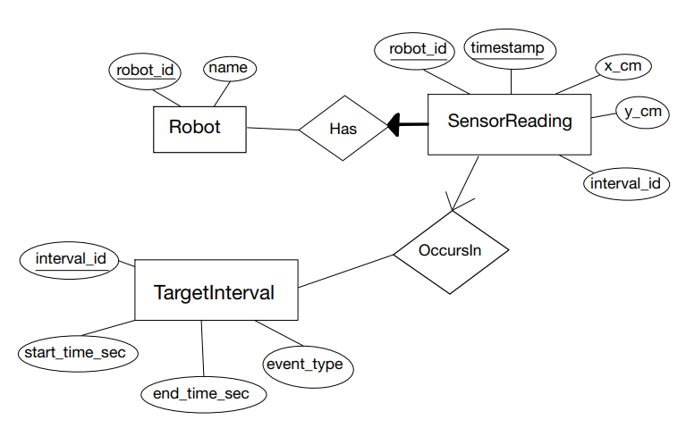

# Robot Sensor Database Project

This project implements a database for storing and analyzing robot sensor readings that occur during specific time intervals.

## Entity-Relationship Model

The ER diagram below represents the conceptual data model for the robot sensor database:



The model consists of three main entities:
- **Robot**: Represents individual robots with sensor capabilities
- **SensorReading**: Sensor data points collected by robots at specific timestamps
- **TargetInterval**: Time intervals of interest where specific events occur

The relationships show that:
- A Robot *has* many SensorReadings
- SensorReadings *occur in* TargetIntervals (when the timestamp falls within the interval's time range)

## Relational Schema

The database schema is implemented with the following tables:

```sql
-- 1. Robot entity
CREATE TABLE Robot (
  robot_id INTEGER PRIMARY KEY,
  name     TEXT    NOT NULL
);

-- 2. TargetInterval entity
CREATE TABLE TargetInterval (
  interval_id    INTEGER PRIMARY KEY AUTOINCREMENT,
  start_time_sec INTEGER NOT NULL,
  end_time_sec   INTEGER NOT NULL,
  event_type     TEXT    NOT NULL
);

-- 3. SensorReading entity (folds in both 1:N relationships)
CREATE TABLE SensorReading (
  robot_id    INTEGER NOT NULL,    -- FK for HasReading (every reading has a robot)
  timestamp   INTEGER NOT NULL,    -- seconds since start
  x_cm        REAL    NOT NULL,
  y_cm        REAL    NOT NULL,
  interval_id INTEGER,             -- FK for OccursDuring (nullable: readings outside intervals)
  PRIMARY KEY (robot_id, timestamp),
  FOREIGN KEY (robot_id)
    REFERENCES Robot(robot_id),
  FOREIGN KEY (interval_id)
    REFERENCES TargetInterval(interval_id)
);
```

## Building the Database

This project includes two Python scripts to create and populate the SQLite database:

### 1. Creating the Schema

Run the `create_schema.py` script to set up the database structure:

```bash
python create_schema.py
```

This script:
- Creates a new SQLite database file named `robot.db`
- Defines the tables according to the relational schema
- Enables foreign key constraints

### 2. Loading Data

After creating the schema, run the `load_data.py` script to populate the database with data:

```bash
python load_data.py
```

This script:
- Loads robot definitions from `csv/robot.csv`
- Loads target intervals from `csv/interval.csv`
- Loads sensor readings from trajectory files (`csv/t1.csv` through `csv/t5.csv`)
- Associates each sensor reading with the appropriate robot and target interval

## Data Organization

The CSV files should be organized as follows:
- `csv/robot.csv`: Contains robot IDs and names
- `csv/interval.csv`: Contains interval definitions (start time, end time, event type)
- `csv/t1.csv` through `csv/t5.csv`: Contain trajectory data (x,y coordinates) for each robot

Make sure these files exist in the `csv` directory before running the data loading script.
